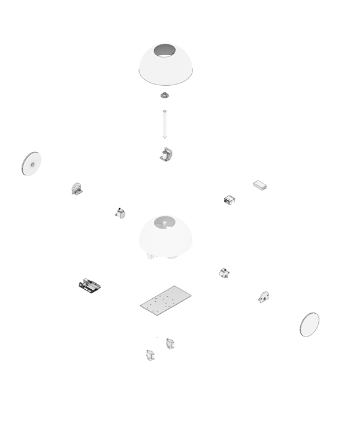
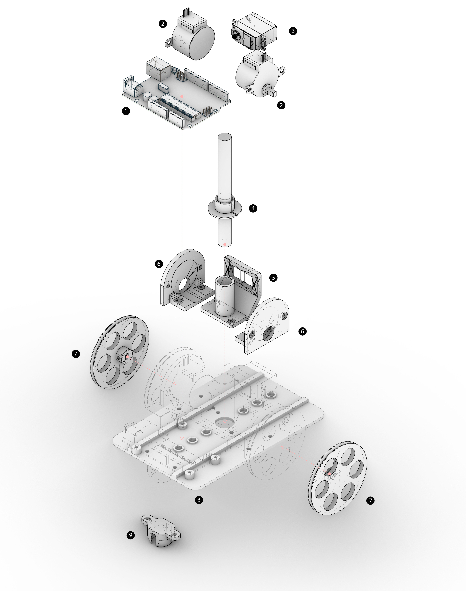
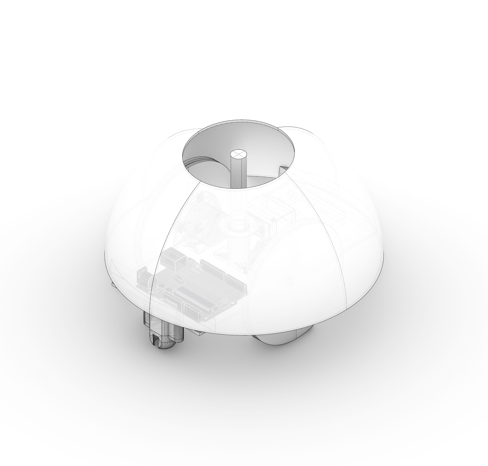
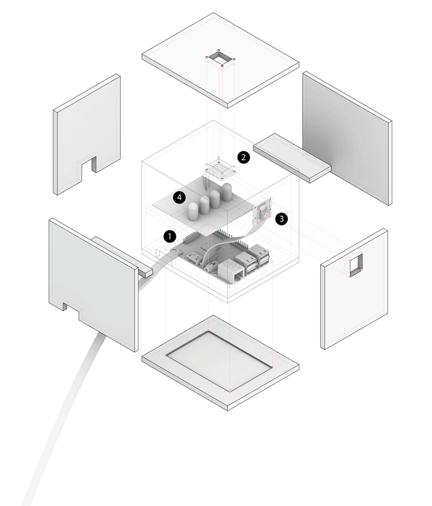

SHEDIO [ _Σχέδιο_ ] --
_noun_
- from Greek origin meaning _'plan', 'drawing', 'scheme'_

-------------------------------

## **IAAC - MRAC 01**

## **DRAWING BOT - HARDWARE II SEMINAR**

**- A minibot that draws contours of images on flat surfaces -**

-------------------------------

### **The Drawing Bot**

-------------------------------

## **GETTING STARTED**

**_Note_**  
For this DIY project, a separate setup of the piCamera (in a box) is in charge of taking the photo that is to be traced by the mini bot.  

Let's do it!

-------------------------------

## **00. HARDWARE**

**First Iteration Parts:**  
(1) Arduino Uno  
(2) 28byj-48 Stepper Motor (x2)  
(3) Mini Servo Motor  
(4) Pen Holder  
(5) Servo Motor Holder (controlling the pen’s movement)  
(6) 3D Printed Wheels (x2)  
(7) 3D Printed Board  
(8) Base Plate  
(9) Ball Bearing Holder  

**_Note_**  
An updated model with the latest parts can be found in the _Hardware folder [here](https://github.com/MRAC-IAAC/SHEDIO/tree/master/_Hardware/3D%20Models).

-------------------------------

## **01. ARDUINO**

### **CALIBRATING THE ROBOT & UNDERSTANDING THE SCRIPT**

First things first, we need to translate string commands into wheel movements (controlled by the motors) to be able to establish a clear language with the mini bot. For that, we also need to calibrate it properly.

Follow the tutorial through this [link](https://www.instructables.com/Arduino-Drawing-Robot/).

All necessary arduino codes can be found [here](https://github.com/MRAC-IAAC/SHEDIO/tree/master/_Scripts/Arduino_codes) with comments. 

-------------------------------

## **02. RASPBERRY PI**
### **text text text**

small description 

links here: ---

-------------------------------

## **03. PYTHON**

**_Note_**  
During this project, the following OS and code editors (not necessary) were used:

**Operating Systems:** macOS, Microsoft Windows and Linux  
**Editor 1:** Visual Studio Code, found [here](https://code.visualstudio.com/)  
**Editor 2:** Pycharm, found [here](https://www.jetbrains.com/pycharm/)

For beginners in Python, the [official website](https://www.python.org/about/gettingstarted/) offers getting started tips.  
 **Socratica's** fun youtube [tutorial](https://www.youtube.com/playlist?list=PLi01XoE8jYohWFPpC17Z-wWhPOSuh8Er-) also provides a step by step guide into the basics of Python.   
 This code uses Python 3.9.

 First start by creating a custom environment for this project, to eventually install necessary libraries. Follow the tutorial on how to do so [here](https://docs.python.org/3/library/venv.html).

For this code, available in the _Scripts folder of the repository [here](https://github.com/MRAC-IAAC/SHEDIO/blob/master/_Scripts/Python_codes/final_script.py), you will need to install the following libraries:  
- [OpenCV](https://docs.opencv.org/master/df/d65/tutorial_table_of_content_introduction.html) library  
- [Numpy](https://numpy.org/install/) library

Understanding the basic of how to find and draw contours using the **OpenCV** library can be found [here](https://docs.opencv.org/master/d4/d73/tutorial_py_contours_begin.html). A simple code can be found [here](https://gitlab.com/fablabbcn-projects/learning/code-club/-/blob/2020/04_computer_vision/02_findcontours.py).

A visual introduction to **Numpy** can be found [here](http://jalammar.github.io/visual-numpy/) for a better understanding of the library and how it works.

A basic explanation of the logic of the code and how it works can be found in this [blogpost](http://www.iaacblog.com/programs/drawing-bot-hardware-ii-seminar/) under "Python Script".

-------------------------------

## **04. FABRICATION**

The necessary parts for this bot were 3D printed. Find the catalogue of parts [here](https://github.com/MRAC-IAAC/SHEDIO/tree/master/_3D%20Print%20Files).  

**You will need:** 
- x1 base 
- x2 wheels
- x2 stepper motor holders
- x1 pen holder 
- x1 servo motor holder 
- x2 ball bearing holder
- x2 ball bearing extentions
- x1 cap 

**You will also need:** 
- x6 screws [M3 x 10] for the base
- x4 screws [M3 x 30] for the extensions
- x10 M3 nuts

The final model should look like this:

**piCamera Box:**  
The piCamera Box can be fabricated through [CNC](https://github.com/MRAC-IAAC/SHEDIO/tree/master/_Fabrication%20Files/CNC) or [Lasercut](https://github.com/MRAC-IAAC/SHEDIO/tree/master/_Fabrication%20Files/Lasercut). We chose to CNC and eventuallty sand the parts to create the frost effect. 

**_Note_**  
You might need to adjust the Lasercut dimensions should you choose a different material (we used 6 mm acrylic).

(1) Raspberry Pi 4B  
(2) Touch Sensor  
(3) PiCamera  
(4) Board of LEDs  

-------------------------------

## **CREDITS**

-------------------------------

**DRAWING BOT - HARDWARE II SEMINAR** is a project of **IAAC, Institute for Advanced Architecture of Catalonia**, developed in the **Master in Robotics and Advanced Construction** in 2020/2021 by:

**Students:** Aslinur Taskin, Helena Homsi and Juan Eduardo Ojeda  
**Faculty:** Oscar Gonzalez  
**Faculty Assistant:** Antoine Jaunard